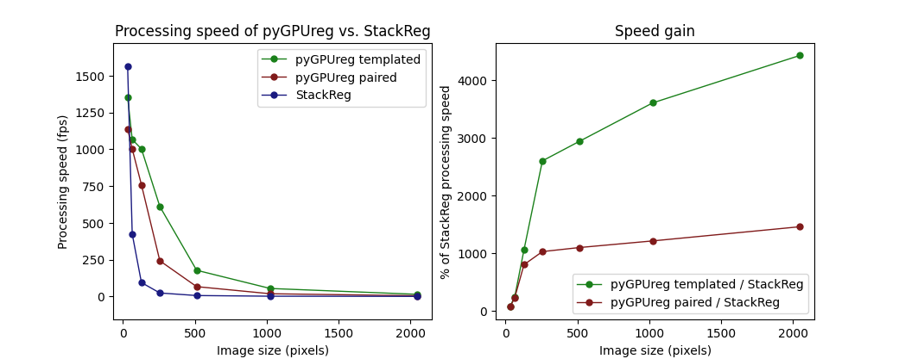
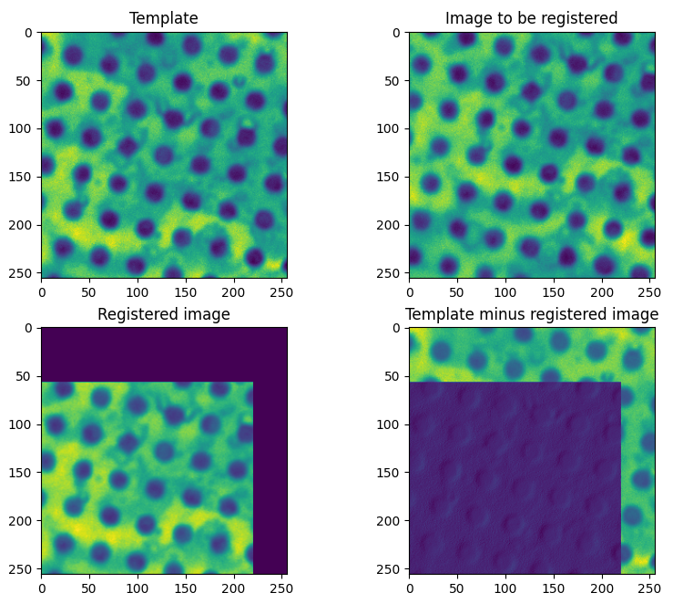
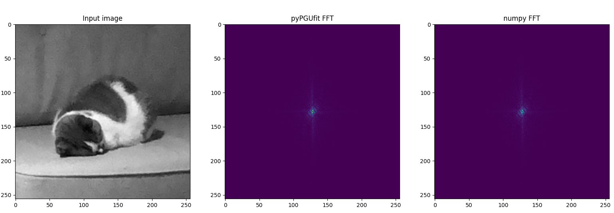

## pyGPUreg ##
pyGPUreg is a minimal Python module for GPU-accelerated image registration designed for use in drift correction of microscopy images. On a PC with an Nvidia Quadro P1000, pyGPUreg can process around 125 images (512 x 512 pixels) per second; this includes shift detection and re-sampling the image to correct the shift.

The module works by computing the phase correlation of input images on the GPU. Our implementation of FFTs on the GPU is largely based on the discussion and code in Fynn-Jorin Flügge's 'Realtime GPGPU FFT Ocean Water Simulation' (doi.org/10.15480/882.1436). pyGPUfit uses OpenGL, so a CUDA compatible card is not required.  

When tested on a Quadro P2200, pyGPUreg is more than 40x faster than StackReg, the Python port of TurboReg (https://pystackreg.readthedocs.io/). For smaller images (32 x 32 pixels or less), CPU-based processing with StackReg is faster. A comparison is plotted below.


### Usage ###
For now, pyGPUreg only works on images that are square and with size 2^n (e.g. 128, 256, 512, etc. pixel width and height)

#### Installation ####
pyGPUreg is available on pypi. Install with pip using the this command:
```
pip install pyGPUreg
```
#### Initialization ####
Prior to calling any of the core functions, pyGPUreg has to be initialized.

```
import pyGPUreg as reg

reg.init()
```

pyGPUreg uses glfw to create an OpenGL context. In .init(), a hidden window is opened, as glfw requires a window for an OpenGL context to be created. Whenever a pyGPUreg function is called after .init(), the module activates its own context and, if another glfw context was active before the function call, swaps back at the end of the function. This way, pyGPUreg can be agnostic of whether it is used in an application where other glfw/OpenGL contexts are used. 

#### Templated drift correction (fastest method) ####
Communication between GPU and CPU is the bottleneck in pyGPUreg. For optimal processing speed, uploads to the GPU must be kept to a minimum. This can be done with 'templated' drift correction: a correction template is manually set and uploaded separately from subsequent to-be-corrected images. If you want to register many images to the same template, this method is best. 
```
import pygpureg as reg
import tifffile
import time

reg.init(image_size=256)

template = tifffile.imread("template_256.tif")
image = tifffile.imread("subject_256.tif")

reg.set_template(template)
timer = time.time_ns()
reg.register_to_template(image)
print(f"Registration took: {(time.time_ns() - timer) * 1e-9:.4f} seconds")
```
```
Registration took: 0.0030 seconds (Quadro P2200)
```

#### Paired drift correction (somewhat slower but more general) ####
In paired drift correction, two images are uploaded to the GPU: a template and an image that is to be registered. FFTs are computed for both images, so this method is slower than templated registration, but if you don't want to use any one template multiple times, paired registration is the way to go; e.g. for registration of a stack by pairing every image with the image prior to it.
```
import pygpureg as reg
import tifffile
import matplotlib.pyplot as plt
import time

reg.init(image_size=256)

template = tifffile.imread("template.tif")
image = tifffile.imread("subject.tif")

timer = time.time()
registered_image, shift = reg.register(template, image, apply_shift=True, subpixel_mode=pygpureg.SUBPIXEL_MODE_COM, edge_mode=pygpureg.EDGE_MODE_ZERO, interpolation_mode=pygpureg.INTERPOLATION_MODE_LINEAR)
print(f"Registration took: {time.time() - timer:.4f} seconds.")

plt.subplot(2,2,1)
plt.imshow(template)
plt.title("Template")
plt.subplot(2,2,2)
plt.imshow(image)
plt.title("Image to be registered")
plt.subplot(2,2,3)
plt.imshow(registered_image)
plt.title("Registered image")
plt.subplot(2,2,4)
plt.imshow(template - registered_image)
plt.title("Template minus registered image")
plt.show()
```

```
Registration took: 0.0090 seconds  (Quadro P2200)
```

#### 2D FFT on the GPU ####
Below is an example of using pyGPUreg to compute a 2D FFT of a grayscale image 
```
import pygpureg as reg
import tifffile
import numpy as np
import matplotlib.pyplot as plt

reg.init()
img = tifffile.imread("pom.tif")
img = img - np.mean(img)

plt.subplot(1,3,1)
plt.imshow(img, cmap="gray")
plt.title("Input image")

plt.subplot(1,3,2)
fft = np.fft.fftshift(reg.gpu_fft(img), axes=(0, 1))
plt.imshow(np.absolute(fft))
plt.title("pyPGUfit FFT")

plt.subplot(1,3,3)
fft = np.fft.fftshift(np.fft.fft2(img), axes=(0, 1))
plt.imshow(np.absolute(fft))
plt.title("numpy FFT")
plt.show()
```


